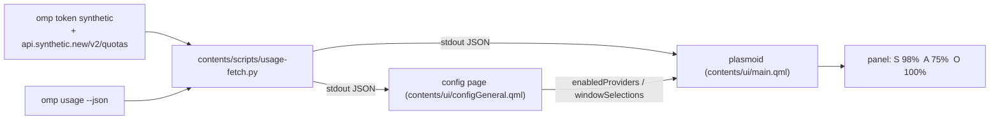

# OMP Usage

A KDE Plasma 6 panel widget showing per-provider [`omp`](https://github.com/oh-my-pi/omp) quota usage, with configurable providers and time windows.



Panel line, one segment per selected provider — remaining percentage above, time until reset below:

```
S 98%   A 75%   O 100%
2d 6h   3h 25m  12d 4h
```

## Features

- One panel segment per provider: remaining percent of the selected window, plus time to reset.
- Providers are discovered from `omp usage --json`, so anything omp reports (synthetic, anthropic, openai-codex, google-antigravity, …) can be shown.
- Per-provider choice of *which* window is on the panel (5h, 7d, monthly, daily/weekly …) — the rest stay in the tooltip.
- Hover for a tooltip with every window of every selected provider: progress bar, percent, reset time; click to pin it as a popup.
- Colour thresholds: green `< 70%` used, amber `70–90%`, red `> 90%`; a failed provider shows a dim `?` on the panel and its error in the tooltip.

## Quick start

Requires Plasma 6, `python3`, `kpackagetool6`, and an authenticated `omp` CLI.

1. Install (or upgrade) the plasmoid:
   ```bash
   ./install.sh
   ```
2. Right-click the panel → *Add or Manage Widgets* → search **OMP Usage** → drag it onto the panel.
3. After an upgrade, reload the shell so Plasma picks up the new QML:
   ```bash
   kquitapp6 plasmashell; kstart plasmashell
   ```

Check what the widget will show without installing anything:

```bash
python3 contents/scripts/usage-fetch.py | python3 -m json.tool
```

## Choosing providers and windows

Right-click the widget → *Configure OMP Usage*.

- **Refresh interval (seconds)** — default `300`, minimum `30`.
- One row per provider: a checkbox (show it on the panel) and a dropdown (which window that segment tracks).

The rows are built from a live fetch each time the dialog opens, so the list always matches what omp currently reports.
A provider whose fetch failed shows its error next to the row and its dropdown is disabled.

Both settings are stored as plain strings in the applet config (`contents/config/main.xml`):

| Key | Value | Meaning |
|-----|-------|---------|
| `enabledProviders` | `""` | show every provider in the payload (default) |
| `enabledProviders` | `anthropic,openai-codex` | show exactly these, in payload order |
| `enabledProviders` | `none` | show nothing (all boxes unchecked) |
| `windowSelections` | `anthropic=anthropic:7d,synthetic=monthly` | which window each provider's segment tracks |

A selection pointing at a window that no longer exists silently falls back to the provider's default window (the rolling 5h window when there is one, otherwise the first).

## Data sources

`contents/scripts/usage-fetch.py` emits one JSON object on stdout and always exits 0; failures travel per provider as `ok: false` + `error`.

- **synthetic** — `omp token synthetic` for the bearer key, then `GET https://api.synthetic.new/v2/quotas`, exposing `monthly` (credit pool), `requests`, and `5h`. The omp report for synthetic is skipped in favour of this richer one.
- **everything else** — one `omp usage --json` call; each report becomes a provider and each `limits[]` entry becomes a selectable window, keyed by the limit id (anthropic has two distinct `7d` limits, so window ids are limit ids, not window ids).

Providers and windows are sorted (synthetic first, then by key) so panel segments never reshuffle between refreshes.

## Uninstall

```bash
kpackagetool6 --type Plasma/Applet --remove com.gar.ompusage
```
